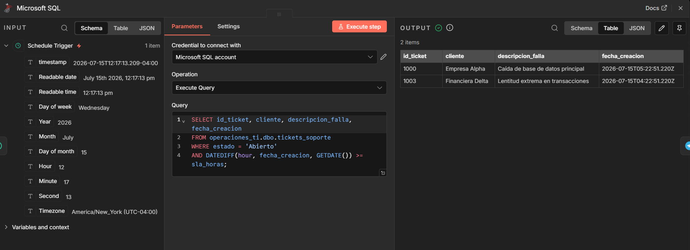
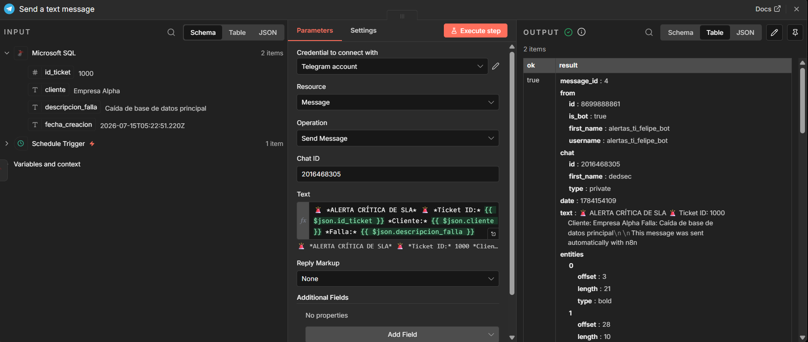
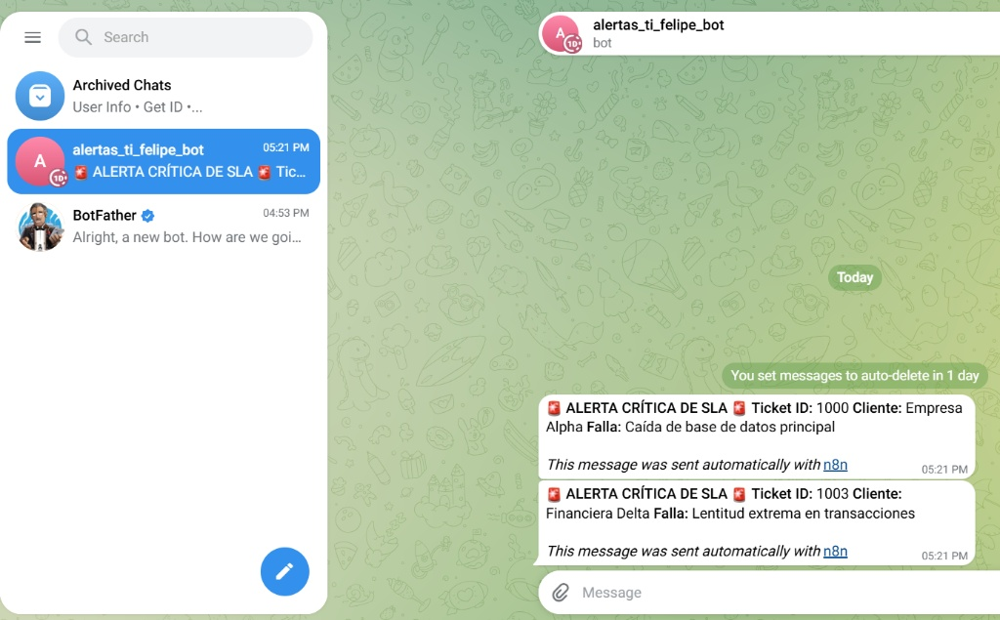

# 🚨 Sistema Automatizado de Alertas de SLA en Tiempo Real

Este proyecto implementa un sistema automatizado de monitoreo de Acuerdos de Nivel de Servicio (SLA) para operaciones de TI y soporte de infraestructura. El sistema consulta de manera cíclica una base de datos relacional para detectar tickets críticos que hayan excedido su tiempo de respuesta límite y dispara de inmediato alertas formateadas a través de un bot de Telegram al equipo de ingenieros de guardia.

---

## 🛠️ Tecnologías y Arquitectura

- **Base de Datos:** SQL Server (Transact-SQL) - Almacenamiento y cálculo de tiempos de expiración de SLAs mediante consultas relacionales optimizadas.
- **Orquestación / ETL:** n8n (Local Self-Hosted) - Programación cíclica del monitoreo y parsing de datos JSON.
- **Notificaciones / ChatOps:** Telegram Bot API - Canal de entrega inmediata de alertas críticas en tiempo real directo a dispositivos móviles.

---

## 📸 Evidencia de Funcionamiento

A continuación, se detalla la ejecución exitosa del flujo de automatización:

### 1. Extracción de Datos (SQL Server)
El nodo de base de datos se conecta exitosamente mediante el puerto 1433, ejecutando el script para extraer únicamente los tickets cuyo SLA ha sido superado.

### 2. Procesamiento y Envío de Alerta (Telegram Node)
El sistema itera automáticamente sobre los resultados y estructura el mensaje cruzando las variables del JSON para enviarlas mediante la API de Telegram.

### 3. Recepción en Tiempo Real (Chat de Soporte)
Las alertas críticas llegan de forma inmediata al dispositivo del ingeniero de guardia, permitiendo una respuesta rápida ante la caída de servicios.

---

## 📋 Prerrequisitos

Para replicar este proyecto localmente, necesitas tener instalado:
1. **Node.js** (Versión 16 o superior)
2. **SQL Server 2022** (Express o Developer Edition) y **SQL Server Management Studio (SSMS)**
3. **Telegram** (Para la creación del bot y recepción de alertas)

---

## ⚙️ Configuración del Entorno

### 1. Base de Datos
Ejecuta el script `esquema.sql` en tu instancia de SQL Server. Este script creará la base de datos `operaciones_ti` y la tabla `tickets_soporte` con registros simulados de prueba.

### 2. Apertura de Puertos (TCP/IP) en SQL Server
SQL Server viene bloqueado de fábrica. Sigue estos pasos para permitir que n8n se conecte de forma local:
1. Abre **SQL Server Configuration Manager**.
2. Ve a **SQL Server Network Configuration** -> **Protocols for MSSQLSERVER**.
3. Habilita el protocolo **TCP/IP**.
4. Haz clic derecho en **TCP/IP** -> **Propiedades** -> pestaña **IP Addresses**. Ve al final a la sección **IPAll** y establece el puerto TCP en `1433`.
5. En **SQL Server Services**, haz clic derecho sobre el motor **SQL Server (MSSQLSERVER)** y presiona **Reiniciar (Restart)**.

### 3. Configuración de n8n
1. Inicia n8n en tu consola ejecutando: `npx n8n`
2. Abre tu navegador en `http://localhost:5678`.
3. Crea tu cuenta local, inicia un nuevo flujo de trabajo e importa el archivo `workflow_alertas_sla.json`.
4. Configura las credenciales de tu base de datos local (`localhost`, puerto `1433`, usuario `sa` y tu contraseña).
5. Configura tu credencial de Telegram pegando el **Bot Token** generado con `@BotFather` y tu **Chat ID** personal.
6. ¡Activa el flujo y observa las alertas en tu celular!
